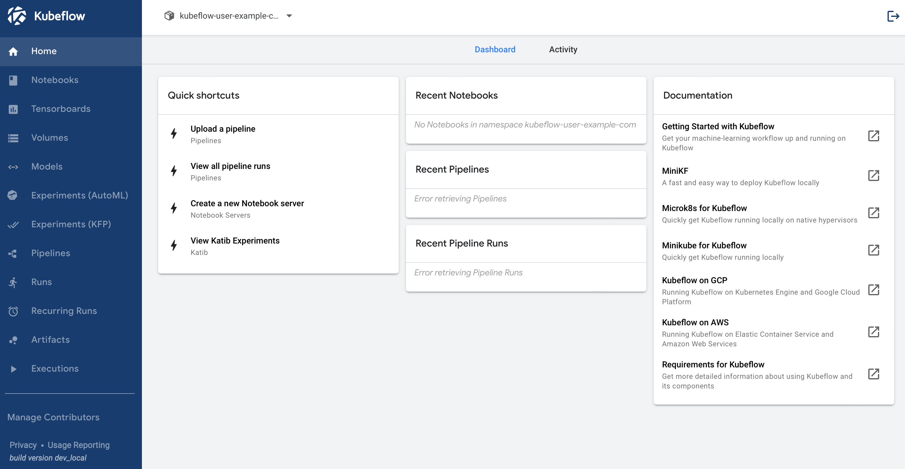

# Kubeflow on Digital Ocean Kubernetes

Tested on Mac OS

## Tools required
- doctl (`brew install doctl`)
- kubectl (`brew install kubectl`)
- kustomize 3.2.0 (get from https://github.com/kubernetes-sigs/kustomize/releases/tag/v3.2.0)

Note: the `kustomize` binary may get blocked by Mac OS when you run it for the first time - this can be bypassed using the "Security & Privacy" settings window

## Steps
### 1. create an API token from Digital Ocean panel
After creating the token, set it in your shell environment:

```
$ export DIGITALOCEAN_ACCESS_TOKEN=<token>
```

### 2. create k8s cluster on Digital Ocean
You can use the terraform config within this project to create a cluster

```
$ cd infra/
$ terraform init
$ terraform plan -out=main.plan
$ terraform apply main.plan
```

By default, this will create a k8s cluster in the Singapore region with the name `kubeflow-cluster`

### 3. set up kubeconfig with doctl tool
Set up the credentials needed to access the new cluster

```
$ doctl kubernetes cluster kubeconfig save kubeflow-cluster

# test connectivity to the cluster
$ kubectl cluster-info
```

### 4. clone the manifests repo
```
$ git clone https://github.com/kubeflow/manifests.git
```

### 5. install kubeflow on the cluster
At this point, you should check the `README.md` file in the manifests repo for
the details on how to install kubeflow using the `kubectl` and `kustomize`
tools. There will be two different methods shown - a "one-liner" approach and
an alternative approach which installs each component one-by-one. I recommend
the latter approach, which will let you observe any errors at each stage. If
there are any errors, try rerunning the command used for that stage again.

### 6. Connect to the kubeflow dashboard

```
$ kubectl port-forward svc/istio-ingressgateway -n istio-system 8080:80
```

